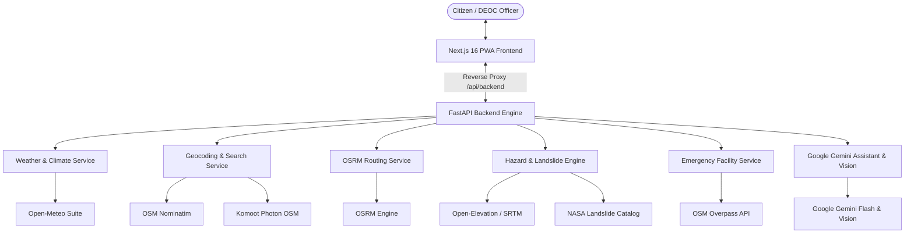

# Apda Mitra (आपदा मित्र) 🛡️🇮🇳
### India's National Early Warning & Disaster Intelligence Platform

> **Smart India Hackathon (SIH) Innovation Project**  
> AI-powered, real-time hyper-local disaster early warning system, interactive Leaflet/OSM GIS command platform, and offline-resilient emergency lifeline for Indian communities and District Emergency Operations Centres (DEOC).

[](https://nextjs.org/)
[](https://fastapi.tiangolo.com/)
[](https://leafletjs.com/)
[](https://open-meteo.com/)
[](LICENSE)

---

## 🌟 Key Highlights & System Capabilities

### 🗺️ Interactive GIS Map & Google Maps-Style UX
- **100% Free & Open-Source Leaflet GIS**: Replaced proprietary tile services with Leaflet and high-performance OpenStreetMap vector/raster tiles, completely eliminating API key restrictions.
- **Google Maps-Style Location Indicator**:
  - Small solid blue center dot (`#1A73E8`) with a crisp `2.5px solid #FFFFFF` white border and subtle outer blue glow ring (`box-shadow: 0 0 0 2px rgba(66, 133, 244, 0.45)`).
  - Expanding sonar pulse ring (`@keyframes gmaps-sonar-pulse`).
  - Dynamic semi-transparent accuracy circle bound directly to `pos.coords.accuracy` in meters.
- **"My Location" Floating Action Button**:
  - Crosshair target icon with explicit *"My Location"* label (or *"मेरा स्थान"* in Hindi).
  - Smooth camera animation via `map.flyTo()` directly to street-level zoom (**16.5**).
  - Inline spinner indicator while acquiring satellite/network GPS lock.
- **Smart Non-Intrusive Centering**: Users can freely pan and drag the map to inspect shelters and hazards without the viewport force-snapping back when telemetry streams update.
- **Dismissible Permission Notice**: Shows a friendly alert (*"Location permission is required to show your position."*) if GPS access is denied, with graceful fallback to the Wayanad, Kerala disaster monitoring station.
- **Category Pins & Emergency Facilities**:
  - **Safe Shelters** (Emerald green pins) with live capacity and occupancy progress meters.
  - **Emergency Hospitals** (Crimson red pins) with 1-tap direct 108 dialers.
  - **Road Hazards & Landslides** (Amber caution pins) with severity badges.
  - **OSRM Navigation**: Driving and walking turn-by-turn route calculation and polyline rendering.

### 🌦️ Live Multi-API Weather & Climate Engine
- **Current Conditions**: Live temperature, feels-like temperature, humidity, precipitation, wind speed, wind direction, and WMO weather codes.
- **Hourly & Daily Forecasts**: 24-hour hourly projections and 7-day multi-day outlooks with rain probabilities.
- **14-Day Historical Rainfall & API**: Cumulative rainfall analysis and 7-day Antecedent Precipitation Index for early landslide hazard detection.
- **Multi-Model Ensemble Forecast**: GFS, ECMWF, and ICON seamless multi-model ensemble bounds.
- **Air Quality & River Discharge**: Real-time PM2.5, PM10, European AQI, and upstream river discharge flood forecasts.
- **Explainable Multi-Factor Disaster Risk Engine**: Transparent hazard scoring across rainfall (35%), soil saturation (25%), slope gradient (20%), historical occurrences (10%), and flood runoff (10%).

### ⚡ Resilient Dual-Tier Architecture & Zero CORS Errors
- **Next.js Reverse Proxy Rewrites**: Client requests routed through same-origin `/api/backend/*` to prevent CORS, port blocking, and mixed-content issues.
- **Dual-Tier Client Fallback**: Automatically falls back to direct API access if proxy routing is interrupted.
- **Dynamic GPS Propagation**: Browser geolocation propagates in real time across the map HUD, Weather & Climate card, and reverse-geocoded header title.

---

## 🏗️ System Architecture



---

## 📋 Completed Tasks & Milestones

For full engineering specifications and code diffs, see [**`TASKS.md`**](file:///c:/Users/Gourob%20Karmakar/Downloads/Apda-Mitra-main/Apda-Mitra-main/TASKS.md).

| # | Milestone / Task | Status | Details |
|---|---|:---:|---|
| **1** | **Weather & Climate API Audit** | ✅ Complete | Verified 9 endpoints (Open-Meteo, Elevation, Air Quality, Historical, Ensemble). Removed all mock data. |
| **2** | **Dynamic GPS Geolocation** | ✅ Complete | Integrated HTML5 Geolocation with reverse geocoding via OSM Nominatim. |
| **3** | **GPS Permission Lifecycle** | ✅ Complete | Handled `granted`, `prompt`, and `denied` states with manual refresh and fallback. |
| **4** | **Leaflet GIS Map Migration** | ✅ Complete | Replaced CARTO/MapLibre with Leaflet + OpenStreetMap tiles (100% free, zero key errors). |
| **5** | **Next.js API Proxy & CORS Fix** | ✅ Complete | Added `/api/backend/*` rewrites and dual-tier routing to eliminate fetch errors. |
| **6** | **Google Maps-Style UI Overhaul** | ✅ Complete | Added solid blue dot, subtle glow ring, accuracy circle, "My Location" FAB (zoom 16.5), and non-intrusive pan exploration. |
| **7** | **Emergency Facilities & Routing** | ✅ Complete | Shelter occupancy meters, hospital 108 emergency dialer, hazard pins, and OSRM route engine. |
| **8** | **Production Build & Verification** | ✅ Complete | 0 TypeScript errors on `next build`. Automated test suite (`verify_all_tasks.py`) passing 9/9 endpoints. |

---

## 🚀 Quick Start Guide

### Prerequisites
- **Node.js**: v18+ (v20+ recommended)
- **Python**: v3.10+ (v3.13 tested)
- **Git**

---

### 1. Backend Setup (FastAPI)

```bash
# Navigate to backend
cd backend

# Create & activate virtual environment
python -m venv venv

# On Windows (PowerShell):
.\venv\Scripts\Activate.ps1
# On Linux/macOS:
source venv/bin/activate

# Install dependencies
pip install -r requirements.txt

# Run backend server
python -m uvicorn app.main:app --reload --port 8000
```
Backend API will be running at `http://localhost:8000` with interactive Swagger docs at `http://localhost:8000/docs`.

---

### 2. Frontend Setup (Next.js PWA)

```bash
# Navigate to frontend
cd frontend

# Install dependencies
npm install

# Start development server
npm run dev
```
Open `http://localhost:3000` in your browser.

---

### 3. Automated API Verification

Run the end-to-end verification suite to validate all live backend endpoints and proxy routes:

```bash
python scripts/verify_all_tasks.py
```

Expected output:
```text
======================================================================
 Apda Mitra: Testing Live Endpoints against http://127.0.0.1:8000/api/v1
======================================================================
 [PASS] HTTP 200 | /weather/current             | Current Weather & Conditions
 [PASS] HTTP 200 | /weather/forecast            | Hourly & Daily Multi-Day Forecast
 [PASS] HTTP 200 | /flood/forecast              | Flood Forecast & Runoff Telemetry
 [PASS] HTTP 200 | /air-quality/current         | Air Quality Index & Pollutants
 [PASS] HTTP 200 | /elevation/profile           | Topographical Elevation & Slope
 [PASS] HTTP 200 | /weather/historical          | Historical Rainfall (14 Days)
 [PASS] HTTP 200 | /weather/ensemble            | Multi-Model Ensemble Forecast
 [PASS] HTTP 200 | /hazard/risk-analysis        | Disaster Risk Analysis & Factor Weights
 [PASS] HTTP 200 | /geocoding/reverse           | Reverse Geocoding (OSM Nominatim)
======================================================================
Results: 9 PASSED, 0 FAILED (Total: 9)
======================================================================
ALL API ENDPOINTS VERIFIED SUCCESSFULLY!
```

---

## 📱 Tech Stack

| Layer | Technologies |
|---|---|
| **Frontend** | Next.js 16 (Turbopack), React 19, TypeScript, Tailwind CSS v4, Lucide Icons |
| **Map Engine** | Leaflet JS (`leaflet`), OpenStreetMap Standard Raster/Vector Tiles, OSRM Polyline |
| **Backend** | Python 3.13, FastAPI, Pydantic v2, Uvicorn, WebSockets |
| **AI & Vision** | Google Gemini 1.5/2.0 Flash, Gemini Vision Incident Classifier |
| **External APIs** | Open-Meteo Suite, OSM Nominatim, Komoot Photon, OSRM, OSM Overpass, Open-Elevation, NASA GLC |

---

## 👥 Contributors & SIH Team

- **Project Lead & Developer**: Anuj Bhardwaj, Gourob Karmakar, Sonu Yadav, Samir Khan, Sneha Bhagat, Manish Kumar
- **Contact**: `anujbhardwaj817@gmail.com`
