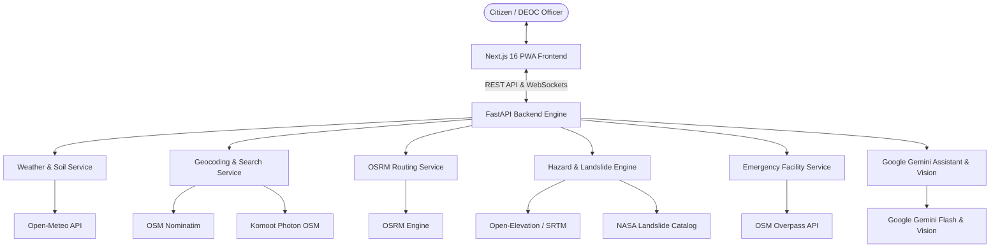

# Apda Mitra (आपदा मित्र) 🛡️🇮🇳
### India's National Early Warning & Disaster Intelligence Platform

> **Smart India Hackathon (SIH) Innovation Project**  
> AI-powered, real-time hyper-local early warning system, MapLibre GL GIS command platform, and offline-resilient emergency lifeline for Indian communities and District Emergency Operations Centres (DEOC).

---

## 🌟 Key Highlights & Architecture

- **🗺️ GPU-Accelerated GIS Map**: Powered by **MapLibre GL JS** with high-resolution Carto Voyager & OpenStreetMap vector/raster tiles, live GPS pulsing location beacon, OSRM turn-by-turn routing, and risk heatmap overlays.
- **⏳ Time-Horizon Predictive Forecasting**: Dynamic time slider (`Now` | `+3h` | `+6h` | `+12h` | `Tomorrow`) that simulates future landslide risks, rainfall accumulations, and route safety.
- **👥 Dual-Mode Experience**:
  - **Citizen Action Map**: Clutter-free interface focused on current location, safe shelters, hospitals, road blockades, and 1-tap SOS 112 emergency calls.
  - **Officer Command Deck**: Multi-layer GIS view with incident triage queue, NASA Global Landslide Catalog historical records, CAP public alert broadcaster, and NDRF asset deployment matrix.
- **📸 3-Step AI Incident Reporting**: Live camera capture with **Google Gemini Vision** automatic hazard categorization and instant WebSocket broadcast.
- **⚡ 100% Free & Open-Source Provider Adapters**:
  - **Meteorology**: Open-Meteo API (hourly precipitation, multi-depth soil moisture 0–27cm).
  - **Geocoding**: OpenStreetMap Nominatim (structured village/taluk/district hierarchy).
  - **Place Search**: Komoot Photon OSM fuzzy autocomplete across India.
  - **Routing**: OSRM driving & walking directions with GeoJSON route lines.
  - **Shelters & Hospitals**: OpenStreetMap Overpass live facility queries.
  - **Elevation**: Open-Elevation / SRTM numerical slope gradient calculation.
  - **Historical Landslides**: NASA Global Landslide Catalog & GSI database.

---

## 🏗️ System Architecture



---

## 🚀 Getting Started

### Prerequisites
- **Node.js**: v18+ (v20+ recommended)
- **Python**: v3.10+ (v3.13 tested)
- **Git**

---

### 1. Backend Setup (FastAPI)

```bash
# Navigate to backend
cd backend

# Create & activate virtual environment
python -m venv venv
# On Windows:
.\venv\Scripts\activate
# On Linux/macOS:
source venv/bin/activate

# Install dependencies
pip install -r requirements.txt

# (Optional) Add your Google Gemini API Key in .env
# GEMINI_API_KEY=your_key_here

# Run backend server
python -m uvicorn app.main:app --reload --port 8000
```
Backend API will be running at `http://localhost:8000` with interactive Swagger docs at `http://localhost:8000/docs`.

---

### 2. Frontend Setup (Next.js PWA)

```bash
# Navigate to frontend
cd frontend

# Install dependencies
npm install

# Start development server
npm run dev
```
Open `http://localhost:3000` in your browser.

---

## 📱 Tech Stack

| Layer | Technologies |
|---|---|
| **Frontend** | Next.js 16 (App Router & Turbopack), React 19, TypeScript, Tailwind CSS v4 |
| **Map Engine** | MapLibre GL JS (`maplibre-gl`), Carto Voyager & OpenStreetMap Tiles, OSRM Polyline |
| **Backend** | Python 3.13, FastAPI, Pydantic v2, Uvicorn, WebSockets |
| **AI & Vision** | Google Gemini 1.5/2.0 Flash, Gemini Vision Image Classifier |
| **External APIs** | Open-Meteo, OSM Nominatim, Komoot Photon, OSRM, OSM Overpass, Open-Elevation, NASA GLC |

---

## 👥 Contributors & SIH Team

- **Project Lead & Developer**:  Anuj Bhardwaj,Gourob Karmakar, Sonu Yadav, Samir Khan, Sneha Bhagat, Manish Kumar
- **Contact**: `anujbhardwaj817@gmail.com`
