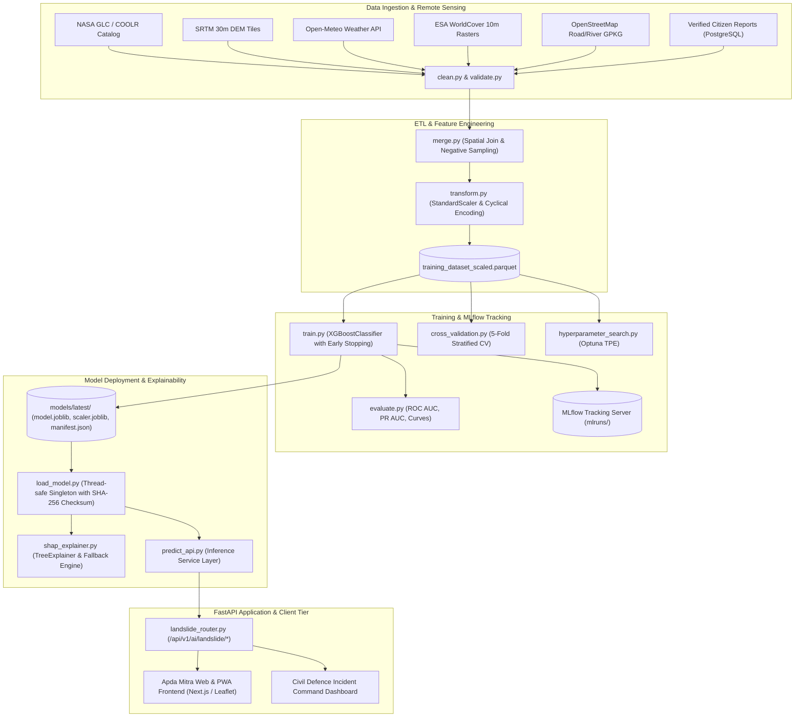

# AI Landslide Engine — System Architecture

## End-to-End Subsystem Topology



## Continuous Learning & Rollback Loop

```mermaid
sequenceDiagram
    autonumber
    actor Admin as Disaster Response Admin
    participant API as FastAPI Landslide Router
    participant Service as LandslideService
    participant Pipeline as RetrainPipeline
    participant DB as PostGIS incident_reports
    participant Trainer as train.py
    participant ModelMgr as ModelManager Singleton

    Admin->>API: POST /api/v1/ai/landslide/retrain
    API->>Service: trigger_retraining(RetrainRequest)
    Service->>Pipeline: dispatch_retraining_job(min_samples)
    Note over Pipeline: Spawn background thread
    Service-->>API: 200 OK (Job status: RUNNING)
    API-->>Admin: RetrainStatusResponse

    Pipeline->>DB: Query verified landslide citizen reports
    Pipeline->>Pipeline: Extract environmental features for reports
    Pipeline->>Pipeline: Append to training_dataset.parquet
    Pipeline->>Trainer: train(save=True)
    Trainer-->>Pipeline: Candidate Model (Metrics & Version)

    alt Candidate ROC AUC < Incumbent ROC AUC - 0.02
        Note over Pipeline: Degradation Detected!
        Pipeline->>Pipeline: Abort promotion; keep incumbent production artifacts
        Pipeline-->>ModelMgr: Retain current version
    else Candidate Metrics Valid
        Pipeline->>Pipeline: Promote candidate files to models/latest/
        Pipeline->>ModelMgr: reload() (Hot-reloads binary into memory)
    end
```
